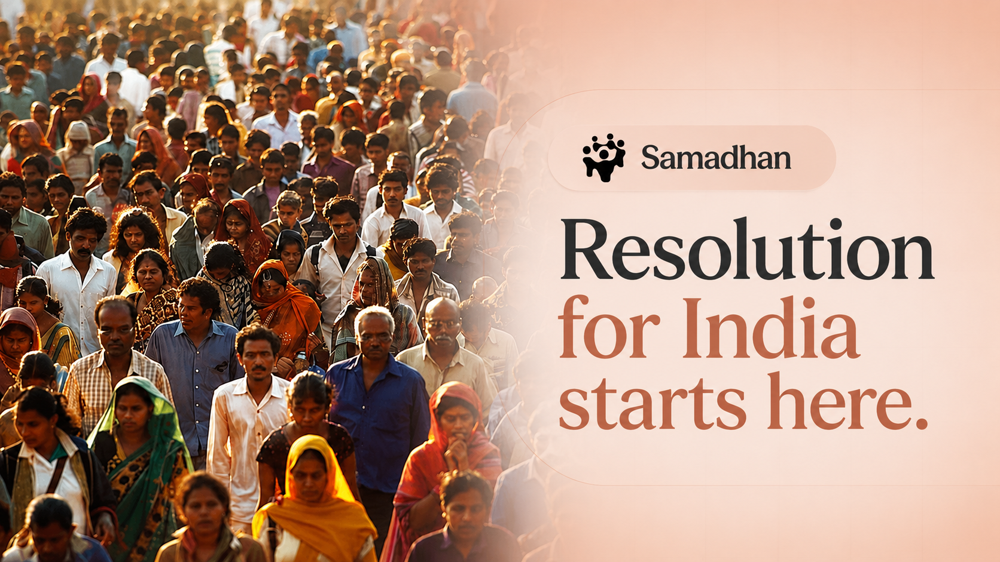

<p align="center">
  
</p>

<p align="center">
  <em>AI-powered civic grievance triage — report, categorize, route, resolve.</em>
</p>

<p align="center">
  
  
  
  
  
  
</p>

<p align="center">
  Built for <strong>Build with Gemma: Kolkata</strong> · Kaggle Hackathon
</p>

---

## Overview

In most Indian cities, reporting a broken streetlight, a dangerous pothole, or an overflowing garbage dump means navigating fragmented helplines and untracked paper trails. Complaints disappear into bureaucratic silos, and public trust erodes along with the infrastructure.

**Samadhan** (Hindi: *resolution*) attacks the real bottleneck — **triage**. Every incoming report is read, categorized, severity-scored, and routed by **Gemma 4 (E2B edge variant)** running locally, with a human administrator retaining one-click authority over every decision.

```
Citizen Report ──▶ Gemma 4 Triage ──▶ Human Approval ──▶ Agent Routing ──▶ Transparent Tracking
   (text + photo)    (category,          (approve /        (function call     (live status,
                      severity,           override)         to department)     ward-scoped)
                      keywords)
```

## Why an Edge Model?

Municipal deployments have three constraints that cloud APIs cannot satisfy:

| Constraint | How Gemma 4 E2B solves it |
|---|---|
| **Cost** | Open weights on local hardware — zero per-request cost at city scale |
| **Data sovereignty** | Citizen photos and locations never leave government infrastructure |
| **Resilience** | Triage keeps running when connectivity doesn't |

## Features

### For Citizens
- 📝 **Plain-language reporting** — describe the issue in your own words, attach photo evidence with GPS location
- 🎫 **Instant ticketing** — every report gets a ticket ID and AI-assigned category in seconds
- 📍 **Ward-scoped tracking** — watch your report move from *Pending Triage* → *Triage Approved* → *Routed* in real time
- 🏆 **Gamification** — earn Impact Points, climb from *Civic Hero* to *Civic Champion* on your ward's leaderboard

### For Authorities
- 🧠 **Live AI triage queue** — Gemma extracts category, severity, keywords, and priority for every incoming ticket
- ✅ **Human-in-the-loop review** — *Approve AI Triage* or *Override AI*; the model proposes, the administrator decides
- 🔀 **Agentic auto-routing** — Gemma invokes `route_issue_to_dept()` to dispatch tickets to PWD, Water Board, Sanitation, Electrical, or Emergency Response, with a persistent audit log
- 🖼️ **Visual Evidence Engine** — Gemma 4's multimodal vision scans citizen photos for hazards and generates incident descriptions
- 📊 **Platform analytics** — report volume and resolution trends per ward

### Engineering
- 🟢 **Live engine status** — sidebar badge polls `/api/health`: loading (amber) → live (green), with graceful heuristic fallback so the platform never goes down while weights warm up
- ⚙️ **Constrained-hardware inference** — 4-bit NF4 quantization with automatic GPU/CPU layer offload, sized for a 4GB laptop GPU
- 🌙 **Full theming** — dark/light mode via CSS variables, Framer Motion animations

## Architecture

```
┌─────────────────────────┐         ┌──────────────────────────────────┐
│   React + Vite (SPA)    │  REST   │        FastAPI Backend           │
│                         │ ◀─────▶ │                                  │
│  Citizen Dashboard      │         │  gemma_engine.py                 │
│  Admin Triage Console   │         │   ├─ triage()        (JSON out)  │
│  Visual Evidence Engine │         │   ├─ route()    (function call)  │
│  Analytics (Recharts)   │         │   └─ describe_image() (vision)   │
└─────────────────────────┘         │                                  │
                                    │  Gemma 4 E2B via kagglehub       │
                                    │  4-bit NF4 · GPU + CPU offload   │
                                    │                                  │
                                    │  SQLite (SQLAlchemy ORM)         │
                                    │  Static uploads (photo evidence) │
                                    └──────────────────────────────────┘
```

## Getting Started

### Prerequisites
- **Node.js** 18+
- **Python** 3.11+
- ~10GB disk for the Gemma 4 E2B checkpoint (downloaded automatically via `kagglehub` on first run)
- Optional: NVIDIA GPU — install the CUDA build of PyTorch for 4-bit GPU inference

### 1. Clone

```sh
git clone https://github.com/pradhan-not-found/Samadhan.git
cd Samadhan
```

### 2. Backend (FastAPI + Gemma 4)

```sh
pip install -r requirements.txt

# GPU users — replace the CPU torch with the CUDA build:
pip install torch --index-url https://download.pytorch.org/whl/cu126

uvicorn backend:app --reload
```

The API starts instantly on `http://127.0.0.1:8000`; Gemma loads in a background thread (endpoints serve heuristic fallbacks until the model reports ready on `/api/health`).

### 3. Frontend (React + Vite)

```sh
npm install
npm run dev
```

Open the printed local URL, sign in as a **Citizen** to file reports or as an **Admin** to run the triage console.

## API Reference

| Method | Endpoint | Description |
|---|---|---|
| `GET` | `/api/health` | Gemma engine status (loading / ready / failed) |
| `POST` | `/api/reports` | Submit a report → Gemma triage → persisted ticket |
| `GET` | `/api/reports` | All tickets for the admin queue |
| `POST` | `/api/reports/{ticket_id}/approve` | Approve AI triage (human-in-the-loop) |
| `POST` | `/api/auto-route` | Gemma agent routes a ticket to a department |
| `POST` | `/api/analyze-image` | Upload + Gemma vision analysis of photo evidence |
| `POST` | `/api/analyze-report-image` | Re-scan a photo already attached to a ticket |
| `POST` | `/api/categorize` | Standalone text triage |

## Project Structure

```
├── backend.py          # FastAPI app — REST API, uploads, persistence
├── gemma_engine.py     # Gemma 4 E2B loading + triage / routing / vision
├── models.py           # SQLAlchemy Issue model
├── database.py         # SQLite session management
├── src/
│   ├── App.jsx         # Landing page
│   ├── AuthPage.jsx    # Citizen / Admin sign-in (ward + state)
│   ├── Dashboard.jsx   # Citizen + Admin dashboards, AI views
│   └── ...
└── uploads/            # Citizen photo evidence (served statically)
```

## Roadmap

- 🗣️ **Multilingual intake** — Bengali and Hindi first; essential for Kolkata
- 🎯 **Fine-tuning** Gemma on real municipal complaint corpora
- 💬 **WhatsApp-bot intake** for citizens without smartphone apps
- 🗺️ **Geo-clustering** — heatmaps of recurring issues for pre-emptive maintenance

## License

Distributed under the [MIT License](LICENSE).

---

<p align="center">
  <i>Building a better India, block by block.</i>
</p>
